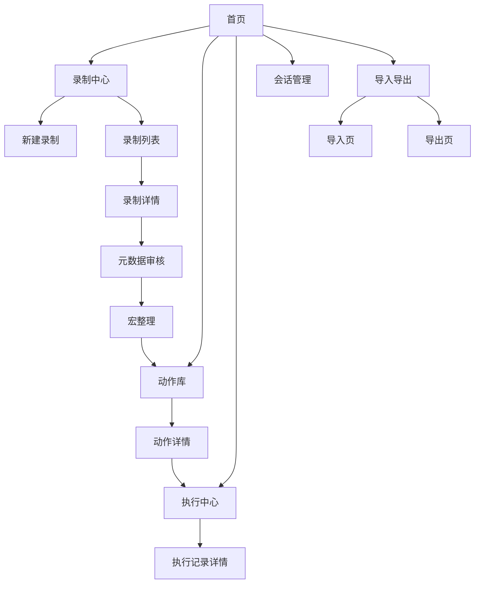

# 产品原型与信息架构

## 相关文档

- [需求文档](./需求文档.md)
- [技术方案设计](../技术文档/技术方案设计.md)
- [开发步骤拆解](../技术文档/开发步骤拆解.md)
- [领域模型与存储模型](../技术文档/领域模型与存储模型.md)
- [录制器与执行器架构设计](../技术文档/录制器与执行器架构设计.md)
- [管理台交互流程](./管理台交互流程.md)
- [首版实现计划](../技术文档/首版实现计划.md)

## 1. 文档目的

本文档用于把 `WebToActions` 的首版产品界面和信息架构整理为可讨论、可实现的低保真原型说明。当前重点不是视觉设计，而是回答以下问题：

- 用户会先看到什么入口；
- 录制、审核、动作整理和执行之间如何跳转；
- 管理台需要承载哪些信息层级；
- 首版在不引入细粒度 `DOM` 事件轨迹的前提下，界面如何仍然保持可用。

## 2. 首版产品形态

首版产品由三个部分组成：

- 本地服务：负责数据管理、录制编排、执行调度和页面渲染。
- `Web` 管理台：负责查看录制结果、审核元数据、整理动作和发起执行。
- 受控浏览器：负责实际录制与执行，复用独立 `Profile` 中的登录态。

对用户而言，管理台是“控制面”，受控浏览器是“执行面”。

## 3. 信息架构总览



## 4. 一级导航设计

首版建议采用顶部一级导航，保持路径清晰：

- `录制中心`：创建录制任务、查看录制列表、进入录制详情。
- `动作库`：首版以查看 `ActionMacro` 为主，`BusinessAction` 仅保留分组或占位入口，统一管理动作状态和版本。
- `执行中心`：发起动作执行、查看运行结果、定位失败原因。
- `会话管理`：查看受控浏览器会话、登录状态和 `Profile` 绑定关系。
- `导入导出`：导出资料包、导入其他机器上的录制或动作资料。

不建议首版把“设置”做成重量级入口，除非后续引入多会话、安全策略和插件配置。

## 5. 页面清单

### 5.1 首页

首页是总览页，核心目标是让用户一眼知道“现在可以做什么”。建议包含：

- 最近录制；
- 最近执行；
- 待审核录制数；
- 快捷入口：`开始录制`、`查看动作库`、`导入资料包`。

### 5.2 录制中心

录制中心应承担两个入口：

- 新建录制：输入目标 `URL`，选择浏览器会话，启动受控浏览器。
- 录制列表：查看历史录制、录制状态、是否已审核、是否已生成宏。

首版列表字段建议包括：

- 录制名称；
- 目标站点；
- 创建时间；
- 证据规模摘要，例如请求数、页面跳转数、上传下载数；
- 审核状态；
- 动作沉淀状态。

### 5.3 录制详情

录制详情是原始证据查看页，但它不应该像传统抓包工具那样只堆请求列表。建议分为三栏：

- 左侧：录制概览与阶段列表；
- 中间：按时间顺序展示页面跳转和网络请求；
- 右侧：选中项详情，包括请求体、响应体、分析结果和字段备注。

由于首版不引入细粒度 `DOM` 轨迹，这一页必须通过“页面阶段 + 请求分组”让用户理解一次录制。

### 5.4 元数据审核页

元数据审核页是首版管理台的核心页面。它要让用户完成以下动作：

- 判断哪些请求是关键请求；
- 标记某个参数来自用户输入、上一步响应或浏览器会话；
- 补充字段说明和业务语义；
- 接受或拒绝系统给出的参数化建议；
- 把一段录制整理为候选宏。

首版不建议把审核页做成自由画布，而应以“时间线 + 详情侧栏 + 注释面板”为主。

### 5.5 宏整理页

宏整理页用于把录制结果提升为 `ActionMacro`。首版建议支持：

- 宏名称和说明；
- 关键步骤列表；
- 步骤依赖关系摘要；
- 运行参数列表；
- 执行前检查项；
- 与原始录制的回溯入口。

如果未来验证发现当前以网络证据、页面阶段和会话状态为主的证据集不足，再在这里引入更细的页面操作步骤和选择器配置。

### 5.6 动作详情页

动作详情页用于查看动作定义本身。页面中至少应有：

- 动作元信息；
- 输入参数；
- 关键步骤；
- 最近执行记录；
- 关联录制与元数据版本；
- 导出入口。

### 5.7 执行中心

执行中心用于统一发起动作执行。首版推荐结构：

- 左侧为动作选择与参数表单；
- 中部为执行实时日志；
- 右侧为浏览器会话、等待状态和结果摘要。

执行中心不应隐藏失败细节，必须支持用户定位失败发生在哪一步。

### 5.8 会话管理页

会话管理页需要回答三个问题：

- 当前有哪些浏览器会话；
- 哪个会话已登录哪些网站；
- 某个录制或动作绑定的是哪个会话。

首版无需复杂权限管理，但要清楚显示会话与动作的绑定关系。

### 5.9 导入导出页

导入导出页主要服务于单机迁移与备份。首版可以简化为两个操作面板：

- 导出：选择录制、动作或完整资料包；
- 导入：上传资料包并查看预览摘要。

需要明确提示：首版资料包不默认迁移活跃登录态。

## 6. 关键页面的低保真原型

### 6.1 首页

```text
[顶部导航] 录制中心 | 动作库 | 执行中心 | 会话管理 | 导入导出

[概览卡片]
- 最近录制：3
- 待审核：2
- 可执行动作：5
- 最近执行失败：1

[快捷操作]
[开始录制] [查看动作库] [导入资料包]

[最近活动]
- 录制 A -> 待审核
- 动作 B -> 执行成功
- 动作 C -> 执行失败
```

### 6.2 录制详情页

```text
[顶部面包屑] 录制中心 / 录制详情

[左栏] 录制概览
- 目标 URL
- 会话 ID
- 页面阶段列表
- 关键请求数

[中栏] 时间线
- 页面跳转
- 请求组 1：列表查询
- 请求组 2：详情获取
- 请求组 3：提交保存

[右栏] 详情与标注
- 请求头 / 请求体 / 响应体
- LLM 分析结论
- 参数来源
- 人工备注
```

### 6.3 元数据审核页

```text
[左栏] 待审核项
- 关键请求候选
- 参数建议
- 风险提示

[中栏] 主工作区
- 阶段摘要
- 请求详情
- 关联上下文

[右栏] 审核操作
- 标记为关键请求
- 标记参数来源
- 接受/拒绝参数化建议
- 生成候选宏
```

### 6.4 执行中心

```text
[左栏] 动作选择
- 动作名称
- 参数表单
- 会话选择

[中栏] 执行日志
- Step 1 启动会话
- Step 2 打开页面
- Step 3 查询列表
- Step 4 执行提交

[右栏] 状态摘要
- 当前页面
- 当前等待条件
- 成功/失败
- 失败定位
```

## 7. 首版信息层级原则

- 一屏只让用户处理一种主任务，不把“录制查看”“审核”“动作编辑”“执行调试”全部混在一起。
- 录制详情和审核页必须能从原始证据跳到抽象结果，也能从抽象结果回跳到原始证据。
- 首版以请求、页面阶段和参数关系为主线，不把界面注意力消耗在细粒度事件流上。
- 执行中心优先展示“当前在做什么”和“失败在哪里”，而不是只展示成功日志。

## 8. 后续增强方向

- 如果后续验证发现当前以网络证据、页面阶段和会话状态为主的证据集不足，可在录制详情和审核页增加 `DOM` 轨迹视图。
- 如果后续支持团队协作，可增加动作版本比较、评论和审核流。
- 如果后续支持 Agent/Skill 调用，可增加面向机器调用的动作发布页。

## 9. 与其他文档的关系

- 本文档定义“界面怎么组织信息”，是管理台和产品层的视图。
- [领域模型与存储模型](../技术文档/领域模型与存储模型.md) 定义“这些页面背后有哪些对象和存储边界”。
- [录制器与执行器架构设计](../技术文档/录制器与执行器架构设计.md) 定义“录制与执行引擎如何工作”。
- [管理台交互流程](./管理台交互流程.md) 继续细化“用户如何一步步完成关键任务”。
- [首版实现计划](../技术文档/首版实现计划.md) 定义“工程上如何按阶段落地这些能力”。
