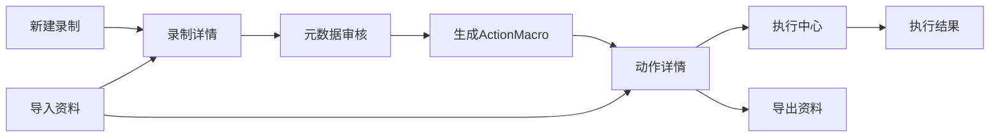

# 管理台交互流程

## 相关文档

- [需求文档](./需求文档.md)
- [技术方案设计](../技术文档/技术方案设计.md)
- [开发步骤拆解](../技术文档/开发步骤拆解.md)
- [产品原型与信息架构](./产品原型与信息架构.md)
- [领域模型与存储模型](../技术文档/领域模型与存储模型.md)
- [录制器与执行器架构设计](../技术文档/录制器与执行器架构设计.md)
- [首版实现计划](../技术文档/首版实现计划.md)

## 1. 文档目的

本文档用于定义 `WebToActions` 首版管理台中的关键用户操作路径。重点不是视觉样式，而是明确：

- 用户做什么动作会进入哪个页面；
- 每个页面允许做哪些决定；
- 关键状态如何流转；
- 哪些交互是首版必须完成的闭环。

## 2. 首版用户主路径

首版建议围绕以下主路径设计管理台：

1. 新建录制；
2. 查看录制结果；
3. 审核元数据；
4. 生成 `ActionMacro`；
5. 发起执行；
6. 查看执行结果；
7. 导出或导入资料。

## 3. 关键状态

### 3.1 录制状态

- `created`：刚创建，尚未开始录制。
- `recording`：浏览器已启动，正在采集证据。
- `pending_review`：录制已结束，审核结果可继续生成动作宏。
- `macro_generated`：已生成可执行宏，录制与动作进入联动状态。

### 3.2 动作状态

首版实现中，`ActionMacro` 没有单独建模为一套前台可编辑状态机，而是以“版本化工件”方式存在：

- 每次从审核结果生成时形成一个明确版本；
- 动作详情页展示步骤、参数和会话要求；
- 是否可执行主要由所选浏览器会话是否可用决定。

### 3.3 执行状态

- `pending`
- `running`
- `succeeded`
- `failed`

## 4. 流程一：新建录制

### 4.1 目标

让用户能快速指定目标 `URL` 并启动受控浏览器。

### 4.2 页面与交互

入口：`录制中心 -> 新建录制`

用户输入项：

- 录制名称；
- 起始 `URL`；
- 浏览器会话选择或新建会话；
- 备注，可选。

用户点击 `开始录制` 后：

1. 管理台创建 `Recording`；
2. 本地服务拉起或绑定 `BrowserSession`；
3. 受控浏览器打开目标 `URL`；
4. 管理台跳转到“录制中”状态页。

### 4.3 录制中页面

录制中页面建议显示：

- 当前录制名称；
- 当前浏览器会话；
- 当前页面 `URL`；
- 已记录请求数；
- 已识别页面阶段数；
- 操作按钮：`结束录制`、`放弃录制`。

首版不需要在录制中页面展示细粒度交互流，以免界面过载。

## 5. 流程二：结束录制并查看录制详情

### 5.1 目标

让用户在录制结束后快速理解“刚才发生了什么”。

### 5.2 状态流转

用户点击 `结束录制` 后：

1. 录制状态从 `recording` 变为 `pending_review`；
2. 本地服务收尾并生成证据索引；
3. 自动触发元数据分析；
4. 页面进入录制详情；
5. 用户可继续进入审核页并保存审核结果。

### 5.3 录制详情页交互

录制详情页应支持：

- 查看页面阶段列表；
- 查看按时间顺序组织的请求；
- 查看上传下载记录；
- 读取单个请求详情；
- 查看系统自动分析摘要；
- 进入审核页。

首版录制详情页的主线应是“页面阶段 -> 请求组 -> 单请求详情”，而不是“海量事件流”。

## 6. 流程三：元数据审核

### 6.1 目标

让用户把原始证据提升为可用的审核结果。

### 6.2 审核页面结构

首版实现采用“单录制审核页”而不是独立审核列表页：

- 入口从录制详情页进入；
- 页面围绕单条录制展示请求、页面阶段、参数建议与审核表单；
- 审核保存完成后，直接在当前页生成动作宏。

### 6.3 审核动作

首版至少支持以下动作：

- 将请求标记为关键请求；
- 将请求标记为噪音请求；
- 标注参数来源；
- 为字段填写中文含义；
- 接受或拒绝参数化建议；
- 将若干页面阶段和关键请求归并为一个动作片段。

### 6.4 完成条件

当以下条件满足时，允许进入宏整理：

- 关键请求已选出；
- 至少一组动作片段已识别；
- 参数建议已完成基础确认；
- 存在可供动作构建使用的审核结果版本。

## 7. 流程四：生成 `ActionMacro`

### 7.1 目标

把审核结果整理成一个可执行宏，并进入动作详情页。

### 7.2 核心交互

当前主路径为：

1. 在审核页保存审核结果；
2. 点击 `生成动作宏`；
3. 系统根据审核结果直接生成 `ActionMacro`；
4. 页面跳转到动作详情页，展示步骤、参数和会话要求。

### 7.3 首版限制

首版明确不支持：

- 动作步骤手工拖拽重排；
- 复杂流程画布；
- 并行分支编辑；
- 基于选择器的页面动作细调；
- 条件分支和循环。

如果后续发现当前以网络证据、页面阶段和会话状态为主的证据集不足，可再增强宏编辑页。

## 8. 流程五：发起执行

### 8.1 目标

让用户在管理台中选择一个可执行动作，并安全地发起执行。

### 8.2 执行前表单

执行前表单当前包含：

- 动作名称；
- 动作版本；
- 参数输入区；
- 浏览器会话选择（仅 `available` 会话可直接执行）；
- 风险提示；
- `开始执行` 按钮。

### 8.3 执行中视图

执行中页面应包含：

- 当前步骤；
- 当前页面；
- 当前等待状态；
- 最近请求摘要；
- 可滚动日志区；
- 中止按钮。

### 8.4 执行后结果页

执行结果页应明确显示：

- 成功或失败；
- 失败步骤；
- 关键步骤与执行日志；
- 结果说明；
- 后续操作：返回动作详情、查看执行中心。

## 9. 流程六：导出与导入

### 9.1 导出

当前统一入口为导入导出页。

导出流程建议：

1. 选择单条录制；
2. 系统按固定范围导出录制、审核结果、动作宏、执行记录与被引用证据文件；
3. 生成资料包；
4. 下载到本地。

### 9.2 导入

导入流程建议：

1. 上传资料包；
2. 系统进行完整性与冲突检查；
3. 写入本地索引与文件区；
4. 返回导入结果、警告与可继续访问的录制/动作/执行 ID。

首版必须明确提示：资料包不默认恢复原浏览器登录态。

## 10. 关键交互规则

- 所有“不可逆”操作都需要确认，例如放弃录制、覆盖导入。
- 所有长耗时操作都需要有可见进度，例如分析中、导出中、执行中。
- 所有失败状态都需要有回退路径，不能只弹一个错误提示就结束。
- 所有从抽象结果跳回原始证据的入口都要清楚，例如从宏步骤回到关键请求。

## 11. 空态与异常态设计

### 11.1 空态

- 没有录制：引导创建第一条录制。
- 没有动作：引导从录制进入审核。
- 没有会话：引导创建或登录受控浏览器会话。

### 11.2 异常态

- 会话失效：提示重新登录并展示受影响动作。
- 分析失败：允许重新分析或手工继续审核。
- 执行失败：展示失败步骤和关键信息，而不是只写“执行失败”。
- 导入冲突：展示冲突对象和处理方式。

## 12. 与其他文档的关系

- [产品原型与信息架构](./产品原型与信息架构.md) 定义了页面层级和导航结构，本文定义的是这些页面上的用户路径。
- [领域模型与存储模型](../技术文档/领域模型与存储模型.md) 定义了流程背后的状态对象。
- [录制器与执行器架构设计](../技术文档/录制器与执行器架构设计.md) 定义了页面动作触发的后台引擎链路。
- [首版实现计划](../技术文档/首版实现计划.md) 将据此拆出前后端与本地服务任务。
