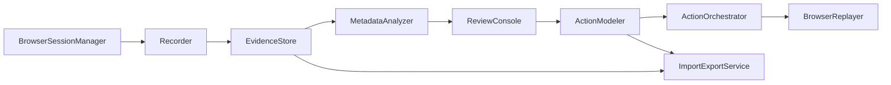

# WebToActions 需求文档

## 1. 文档定位

本文档用于固化 `WebToActions` 的首版产品需求，目标是把“浏览器中录制用户操作，并沉淀为可复用动作”的想法整理为可落地的产品定义。当前阶段只讨论需求、边界和演进方向，不锁定具体技术框架，不进入详细实现设计。

## 2. 产品定义

`WebToActions` 是一个以浏览器为执行载体的动作采集与重放系统。首版产品形态明确为：

- 一个驻留在本机的服务层；
- 一个用于查看、审核和整理动作的 `Web` 管理台；
- 一个由工具管理的受控浏览器与独立会话。

它的核心能力不是“单纯抓接口”，而是：

- 由工具拉起一个受控浏览器和独立会话；
- 用户在浏览器中完成真实操作；
- 系统同时记录网络请求、页面导航上下文和会话状态信息；
- 系统基于这些证据生成元数据草案；
- 人工在管理台中审核、修正、参数化并抽象为可复用动作；
- 后续由工具再次在浏览器上下文中执行该动作，以复用真实登录态和页面运行环境。

一句话定义：

> `WebToActions` 是一个“浏览器执行优先、网络证据驱动、支持人工审核和动作抽象”的本地自动化工具。

## 3. 背景与问题

很多真实网站上的业务流程无法仅靠纯 API 稳定复现，原因包括但不限于：

- 登录态分散在 `Cookie`、`localStorage`、`sessionStorage`、前端内存状态等多个位置；
- 请求参数可能依赖页面运行时逻辑、前置接口结果或动态生成的签名；
- 一个用户动作背后可能伴随页面跳转、多个并发请求、本地状态更新、文件上传下载、轮询或弹窗确认；
- 仅记录接口很难准确还原“用户到底做了什么”，也难以解释字段的业务语义。

因此，系统不能把“接口回放”作为首版唯一执行模型，而应把浏览器作为真实执行环境，把网络记录作为理解和抽象动作的证据源。

## 4. 产品目标

首版产品目标如下：

- 允许用户输入一个目标 `URL`，并在受控浏览器中开始录制。
- 记录用户完成某个业务流程时产生的关键证据，包括网络、页面导航和会话上下文。
- 生成对录制结果的可审查元数据草案，而不是只输出原始抓包。
- 提供一个可交互管理台，让用户人工确认接口用途、字段来源、参数含义和依赖关系。
- 让一段录制结果先沉淀为可回放宏，再逐步提升为结构化业务动作。
- 允许用户在后续通过工具重新执行动作，执行环境以浏览器重放为主。
- 支持本地导出与导入，方便迁移、备份和后续共享。

## 5. 非目标

以下内容不作为首版必须目标：

- 做成通用桌面自动化平台，覆盖浏览器之外的大量本机应用操作；
- 以纯 API 方式完整替代浏览器执行；
- 从一开始支持团队协作、远端共享、权限管理和集中式存储；
- 自动理解所有业务语义并完全替代人工审核；
- 自动突破验证码、风控、二次验证或网站反自动化机制；
- 为 Agent/Skill 提供稳定的外部调用协议。

## 6. 关键设计原则

- 浏览器执行优先：执行动作时优先使用浏览器上下文，而不是强行转化为纯 API 调用。
- 证据先于抽象：先完整保存可解释证据，再从证据中抽象元数据和动作。
- 人工审核是主流程：LLM 可以给出草案，但字段语义、依赖关系和业务边界必须允许人工确认。
- 渐进式动作建模：先有“能回放”的宏，再有“有语义”的业务动作。
- 单机优先，结构留口：首版以本地使用为主，但数据模型应允许未来扩展到共享和版本化。

## 7. 目标用户与典型场景

首批目标用户：

- 需要把浏览器中的重复业务流程沉淀为可复用动作的个人用户；
- 经常处理后台系统、管理系统、表单系统的业务人员或技术人员；
- 需要研究某个网站业务流程由哪些接口和页面状态共同构成的分析型用户。

典型场景包括：

- 在后台系统中创建、查询、提交或审批某个业务对象；
- 打开列表页，选择某条数据，进入详情后执行后续操作；
- 在复杂表单中录入内容、上传文件并提交；
- 先执行查询，再根据结果选择目标项继续处理。

## 8. 核心术语与领域模型

### 8.1 `BrowserSession`

由工具管理的浏览器会话，包含独立 `Profile`、登录态、Cookie、Storage 和运行时上下文。首版使用工具自有会话，后续再考虑兼容用户已有浏览器会话。

### 8.2 `Recording`

一次完整录制任务，通常从“用户输入目标 URL 并开始录制”开始，到“用户主动结束录制”结束。一个 `Recording` 可以对应一个候选动作，也可以作为后续拆分多个动作的原始素材。

### 8.3 `Evidence`

录制过程中保存的原始证据集合。首版至少包含：

- HTTP/HTTPS 请求与响应；
- 页面 URL、跳转轨迹和时间序列；
- `Cookie` 与 `Storage` 变化；
- 文件上传和下载信息；
- 页面导航阶段、时间序列和关键等待点。

### 8.4 `MetadataDraft`

系统基于 `Evidence` 和大模型生成的元数据草案，用于解释每个关键请求或页面阶段的业务用途、字段含义、依赖来源、特殊请求头和响应语义。

### 8.5 `ReviewedMetadata`

人工审核后的元数据结果。它不是原始证据的替代品，而是面向后续动作抽象和执行的高可信解释层。

### 8.6 `ActionMacro`

从一次录制中沉淀出的可回放宏，首版主要依据网络证据、页面阶段和人工审核结果生成。它强调“先能跑”，不强求一开始就具备高业务语义，也不要求首版依赖细粒度 `DOM` 事件直录。

### 8.7 `BusinessAction`

在 `ActionMacro` 基础上抽象出的结构化业务动作，例如“创建工单”“提交报销”“审批第一条待办”。它由一组具备语义的步骤、参数、依赖和输出组成。

### 8.8 `Parameter`

动作运行时需要外部输入或动态计算的值，例如表单内容、选择条件、上传文件路径、请求中的关键业务字段等。首版支持系统自动建议可参数化字段，再由人工确认。

### 8.9 `ExecutionRun`

一次实际执行记录，描述某个宏或业务动作在某个浏览器会话中被执行的过程、输入参数、关键事件、成功结果和失败原因。

## 9. 端到端流程

更细一点的业务解释如下：

1. 用户提供目标 `URL`，工具打开受控浏览器会话。
2. 用户在浏览器中完成希望被记录的业务流程。
3. 系统在后台按时间顺序采集原始证据，并将其组织为可检索的录制结果。
4. 系统调用大模型对关键片段进行初步分析，生成元数据草案。
5. 用户在管理台中查看分析结果，修正字段语义、依赖链路、关键请求和参数建议。
6. 系统先生成一个可回放宏；用户可继续把它整理为结构化业务动作。
7. 未来执行时，系统重新拉起浏览器上下文，在已有登录态基础上执行动作，并保存运行结果。

## 9.1 系统模块视图

从需求层面看，首版系统至少包含以下模块：

- `BrowserSessionManager`：负责受控浏览器、独立 `Profile` 和会话生命周期。
- `Recorder`：负责采集网络、页面导航和会话上下文证据。
- `EvidenceStore`：负责本地保存原始证据和录制结果。
- `MetadataAnalyzer`：负责基于证据生成元数据草案和参数建议。
- `ReviewConsole`：负责人工审核、修正、确认和提升动作定义。
- `ActionModeler`：负责生成 `ActionMacro` 并逐步提升为 `BusinessAction`。
- `ActionOrchestrator`：负责步骤串联、参数绑定、依赖解析、输出回填和执行前动作展开。
- `BrowserReplayer`：负责在浏览器上下文中执行宏或业务动作。
- `ImportExportService`：负责录制、动作和元数据的导入导出。

这些模块是产品层面的职责边界，不代表必须一一对应为独立进程或独立代码仓库。

## 10. 证据采集需求

首版录制器需要满足以下要求：

- 用户能显式开始录制和结束录制。
- 录制入口要求支持指定一个起始 `URL`。
- 工具启动的浏览器必须与录制任务关联，避免会话混淆。
- 所有请求响应都要带时间顺序，以便后续重建因果关系。
- 请求侧至少保留 `URL`、方法、请求头、请求体、发起时机和触发上下文。
- 响应侧至少保留状态码、响应头、响应体、耗时和失败信息。
- 记录页面跳转、前后页面地址、触发方式和关键等待点。
- 记录页面阶段变化、关键加载节点和可观测等待点。
- 记录 `Cookie` 和 `Storage` 的关键变化，帮助解释登录态和会话参数。
- 记录文件上传与下载的来源、目标和上下文步骤。

首版不要求记录细粒度 `DOM` 事件流，也不要求把所有浏览器内部细节都抽取为可执行规则，但必须保证后续人工能够基于证据理解一次录制到底发生了什么。

## 11. 元数据分析需求

系统需要对录制证据做第一轮自动分析，输出可审核草案。重点包括：

- 识别哪些请求属于“关键业务请求”，哪些只是噪音或配套请求；
- 为关键请求生成用途说明，例如“查询列表”“获取详情”“提交表单”“上传附件”；
- 解释重要参数可能表示什么，以及它们可能来自哪里；
- 标注参数来源是固定值、用户输入、上一步响应、页面状态还是浏览器会话信息；
- 解释响应中哪些字段可能决定后续流程；
- 识别是否存在特殊请求头、令牌或风控相关字段；
- 尝试把多个请求与一个用户动作或页面阶段进行关联。

分析结果允许不完整、不准确，但必须可审核、可修正、可追溯到原始证据。

## 12. 人工审核管理台需求

首版必须提供一个真正可用的管理台，而不是只输出 JSON。管理台至少应支持：

- 查看录制列表和录制详情；
- 按时间轴查看页面跳转、网络请求和会话状态变化；
- 查看单个请求的请求头、请求体、响应体和分析结论；
- 对字段进行重命名、注释、分组和标记；
- 人工确认“这个参数从哪来”“这个响应给后续哪一步使用”；
- 人工判断哪些请求是动作核心，哪些是可忽略噪音；
- 查看系统建议的可参数化字段，并决定是否采纳；
- 把一段录制整理为候选宏，或继续提升为结构化动作；
- 显示敏感数据风险提示。

管理台的本质不是“抓包查看器”，而是“动作知识整理器”。

## 13. 动作抽象需求

动作模型采用两层结构。

### 13.1 第一层：`ActionMacro`

`ActionMacro` 面向快速复用，核心要求如下：

- 能按照录制时的步骤在浏览器中重放；
- 能保留关键等待条件、页面阶段和经人工确认后的执行步骤顺序；
- 允许存在部分原始细节，不要求一开始就做强抽象；
- 能在后续审核阶段继续被修改和提升。

首版建议把 `ActionMacro` 的最小步骤模型定义为高层页面步骤，而不是细粒度元素事件。例如：

- 打开目标页面；
- 等待进入某个页面阶段；
- 注入运行参数；
- 执行某个业务步骤；
- 校验关键请求或关键响应；
- 给出结果确认。

这些步骤应主要来自审核后的页面阶段、关键请求和参数关系，而不是从 `DOM` 事件流中自动恢复。

### 13.2 第二层：`BusinessAction`

`BusinessAction` 面向语义化复用，核心要求如下：

- 一个动作应能表达明确业务目的，而不只是“重复点一遍页面”；
- 一个动作可包含多个串行步骤，未来可扩展并行能力，但首版不要求复杂编排；
- 动作应能声明输入参数、依赖条件和关键输出；
- 动作应保留与原始证据的追溯关系，便于回看和修订。

推荐的升级路径是：

1. 先录制一次真实流程；
2. 形成一个 `ActionMacro`；
3. 借助自动分析和人工审核，把宏中的固定值替换为参数，把关键步骤命名为业务步骤；
4. 最终形成 `BusinessAction`。

## 14. 参数化需求

首版参数化能力需要兼顾可用性和复杂度，要求如下：

- 系统自动建议哪些字段可能适合作为运行参数；
- 人工可以采纳、拒绝或修改这些建议；
- 参数既可以来源于页面输入，也可以来源于请求体、查询参数、路径参数或文件路径；
- 参数需要支持名称、说明、是否必填、默认值等基础属性；
- 参数与动作步骤之间要保留绑定关系，避免后续执行时不知道参数注入到哪里。

首版不要求支持复杂表达式系统，但至少要支持“把录制时的固定值替换成运行时输入”。

## 14.1 动作编排需求

虽然首版不追求复杂工作流编排，但仍需要一个明确的动作编排层，负责把“定义好的动作”转换成“可执行的步骤序列”。首版至少应支持：

- 根据 `ActionMacro` 或基础 `BusinessAction` 生成可执行步骤；
- 在步骤之间传递参数、上下文和中间结果；
- 维护步骤顺序、等待条件和基础依赖关系；
- 把人工审核确认后的字段映射到具体执行位置；
- 在执行失败时指出失败发生在哪一步，而不只是给出整次执行失败。

首版的编排范围应控制在“顺序执行 + 基础依赖传递”内，不要求完整支持复杂并行、循环和高级条件分支。若当前以网络证据、页面阶段和会话状态为主的证据集无法支撑稳定动作定义，再在后续版本补充细粒度 `DOM` 轨迹采集能力。

## 15. 执行需求

动作执行的核心原则是：在浏览器上下文中执行，而不是强制转换为纯 API 调用。

首版执行层至少需要满足：

- 能从已有宏或业务动作发起执行；
- 能优先执行 `ActionMacro`，并为后续执行 `BusinessAction` 预留兼容能力；
- 执行时使用工具管理的浏览器会话和登录态；
- 支持用户输入运行参数；
- 能根据动作要求完成页面操作、等待、跳转和结果确认；
- 记录执行过程中的关键日志和结果；
- 在失败时保留足够上下文，方便人工排查。

以下执行理念需要在文档中明确：

- 网络接口信息用于帮助系统理解和校验动作，不是首版唯一执行载体；
- 对那些明显依赖浏览器上下文的流程，执行层不应尝试强行降级为纯 API；
- 未来可以对稳定步骤做局部优化，但首版不以“无浏览器执行”为目标。

## 16. 浏览器会话与登录态需求

首版浏览器会话策略如下：

- 由工具创建和管理独立浏览器 `Profile`；
- 用户在该会话中自行登录目标系统；
- 录制与执行优先复用该独立会话中的登录信息；
- 会话与动作之间需要有可关联关系，避免录制于 A 会话、执行于 B 会话导致状态不一致。

后续可以考虑：

- 导入或复用用户已有浏览器 `Profile`；
- 多会话管理；
- 更细粒度的会话隔离和共享策略。

## 17. 本地存储与导出导入需求

首版以单机使用为前提，存储策略要求如下：

- 录制结果、元数据、动作定义和执行记录均保存在本地；
- 用户可以导出某个动作或某次录制的完整资料包；
- 用户可以导入资料包到另一台机器继续查看或编辑；
- 首版导出与导入不默认迁移活跃登录态，而是聚焦迁移录制资料、元数据、动作定义和运行记录；
- 导出内容应尽量保持自描述，便于未来版本继续读取。

这意味着数据组织上应区分：

- 原始证据；
- 审核后的元数据；
- 动作定义；
- 执行结果。

## 18. 敏感数据策略

根据当前需求讨论，首版敏感数据策略采用：

- 本地明文存储；
- 在界面中显式提示存在风险；
- 允许用户在审核阶段识别敏感字段。

同时要明确写入后续路线图的改进方向：

- 默认脱敏展示；
- 受保护存储或按需查看；
- 更细粒度的导出脱敏策略。

## 19. MVP 边界

首版 MVP 必须具备：

- 输入目标 `URL` 并启动受控浏览器录制；
- 基于独立 `Profile` 维护浏览器会话和登录态；
- 记录网络请求响应、URL/跳转、Cookie/Storage、文件上传下载和页面阶段信息；
- 生成元数据草案，并支持人工审核和修正；
- 提供可交互管理台；
- 支持从录制结果生成可回放宏；
- 支持自动建议参数化字段并人工确认；
- 支持浏览器中执行 `ActionMacro`；
- 支持导出与导入。

首版可弱化但最好具备：

- 基于审核结果生成初步的结构化业务动作；
- 对动作输入输出做基础定义；
- 对简单 `BusinessAction` 做试运行；
- 对关键步骤提供更清晰的命名和注释。

首版明确不做或不强求：

- 团队协作、多人共享、权限系统；
- 复用用户本机已有浏览器 `Profile`；
- 复杂并行编排、分支判断和高级控制流；
- 细粒度 `DOM` 事件轨迹采集与基于选择器的自动动作恢复；
- 纯 API 执行器；
- Agent/Skill 直接调用；
- 强安全存储、统一密钥管理；
- 绕过验证码、反爬或网站风控机制。

## 20. 建议的分阶段路线

### 阶段 A：录制与证据沉淀

目标是让系统先基于“网络请求/响应 + 页面导航 + 会话状态”录到“足够解释业务流程”的原始证据，并验证暂不引入细粒度 `DOM` 轨迹是否仍然可用。

### 阶段 B：元数据分析与人工审核

目标是让一段录制从“抓到很多原始日志”进化为“用户和系统都能理解的结构化素材”。

### 阶段 C：宏回放

目标是先让系统能在浏览器中稳定重放关键流程，验证基于网络证据和人工建模得到的宏是否具备可执行性。

### 阶段 D：业务动作抽象

目标是把宏逐步升级为更有业务语义、更适合复用的动作定义。

### 阶段 E：共享与生态扩展

目标是支持更安全的存储、更好的导出共享，以及未来与 Agent/Skill 的对接。

## 21. 关键风险与待验证假设

当前已经识别出的风险和待验证事项包括：

- 某些网站可能存在复杂风控、验证码或一次性动态参数，导致录制可见但执行不稳定。
- 仅靠自动分析未必能正确判断字段语义和依赖链，人工审核强度可能高于预期。
- 若不采集细粒度 `DOM` 轨迹，当前以网络证据、页面导航和会话状态为主的证据集是否足以支撑动作抽象与浏览器执行，仍需重点验证。
- 浏览器回放中的等待条件和页面稳定性判断是执行成功率的关键难点。
- 本地明文存储虽然符合当前需求，但在真实使用中可能很快暴露安全问题。
- 若不同网站差异过大，通用化能力可能需要比预期更多的网站适配策略。

需要在后续架构设计或原型阶段重点验证：

- 证据采集的最小充分集到底是什么；
- 是否必须引入细粒度 `DOM` 轨迹，还是网络证据加页面阶段就已足够；
- 自动参数建议的准确率能否让人工审核真正提效；
- `ActionMacro` 到 `BusinessAction` 的升级路径是否足够顺滑；
- 导出包的格式是否能兼顾可读性、可迁移性和未来兼容。

## 22. 后续文档建议

在本需求文档之后，建议继续产出以下文档：

- [技术方案设计](../技术文档/技术方案设计.md)
- [开发步骤拆解](../技术文档/开发步骤拆解.md)
- [产品原型与信息架构](./产品原型与信息架构.md)
- [领域模型与存储模型](../技术文档/领域模型与存储模型.md)
- [录制器与执行器架构设计](../技术文档/录制器与执行器架构设计.md)
- [管理台交互流程](./管理台交互流程.md)
- [首版实现计划](../技术文档/首版实现计划.md)

## 23. 当前结论

`WebToActions` 的首版不应被做成“抓接口然后直接回放接口”的工具，而应被定义为：

> 一个以受控浏览器为真实执行环境、以网络和页面证据为分析基础、以人工审核为关键环节、以动作逐步抽象为核心价值的本地自动化系统。

这一定义将直接决定后续架构设计、数据模型、管理台交互和执行层策略。
