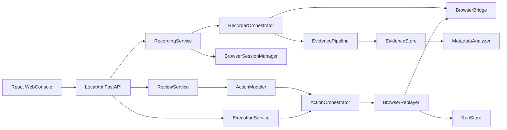
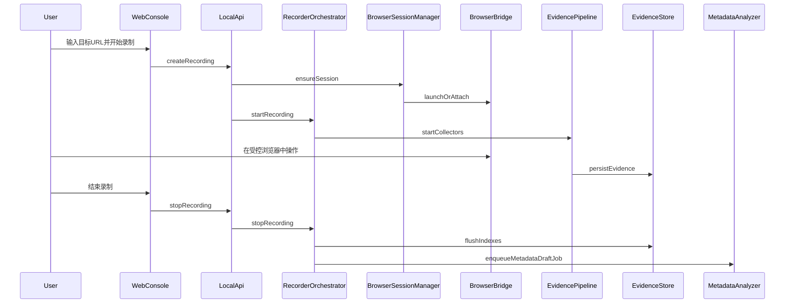
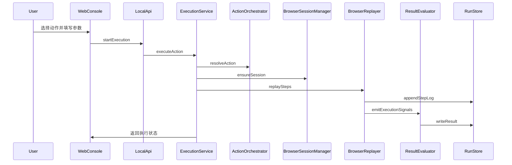

# 录制器与执行器架构设计

## 相关文档

- [需求文档](../产品文档/需求文档.md)
- [技术方案设计](./技术方案设计.md)
- [开发步骤拆解](./开发步骤拆解.md)
- [产品原型与信息架构](../产品文档/产品原型与信息架构.md)
- [领域模型与存储模型](./领域模型与存储模型.md)
- [管理台交互流程](../产品文档/管理台交互流程.md)
- [首版实现计划](./首版实现计划.md)

## 1. 文档目的

本文档用于定义 `WebToActions` 首版中“录制器”和“执行器”两条核心引擎链路的职责边界、组件划分和数据流。目标不是落到具体代码，而是明确：

- 录制器到底采什么；
- 执行器到底依赖什么来回放；
- 本地服务、管理台和受控浏览器之间如何协作；
- 在不引入细粒度 `DOM` 事件轨迹的前提下，系统如何仍然可用。

## 2. 首版架构原则

- 本地服务是唯一控制中心：录制、审核、动作整理和执行都由本地服务协调。
- 受控浏览器是唯一真实执行环境：不把纯 API 调用当作首版主执行路径。
- 网络证据是首版录制主轴：优先采集请求响应、页面导航、会话状态和文件传输。
- 人工审核是动作形成的必要环节：录制器输出的是证据，不是最终动作。
- 扩展能力前置预留：未来若验证当前以网络证据、页面阶段和会话状态为主的证据集不足，再补细粒度 `DOM` 轨迹能力。

## 3. 建议技术落点

结合当前项目约束，建议首版技术落点如下：

- 本地服务：`Python 3.11+ + FastAPI`
- 管理台：`React + TypeScript`，开发期前后端分离，运行期由本地服务挂载静态资源
- 领域与数据模型：`Pydantic v2`
- 持久化：`SQLite + SQLAlchemy 2 + Alembic`
- 浏览器控制层：`Playwright Python`
- 本地存储：结构化索引层 + 文件对象区

这里的关键不是技术栈是否“重型”，而是控制面稳定、可本地运行、易于调试，并且适合快速验证核心闭环。

## 4. 总体组件图

## 5. 录制器架构

### 5.1 录制器职责

录制器负责把“用户在受控浏览器中的一次业务流程”转化为结构化证据集合。首版录制器不做两件事：

- 不负责直接产出最终业务动作；
- 不负责采集细粒度 `DOM` 事件流。

### 5.2 录制器核心组件

#### `BrowserSessionManager`

负责：

- 创建和回收受控浏览器会话；
- 维护独立 `Profile`；
- 管理会话状态与登录态摘要；
- 对录制和执行暴露统一会话接口。

#### `RecorderOrchestrator`

负责：

- 接收“开始录制 / 结束录制”命令；
- 绑定录制与浏览器会话；
- 协调证据采集组件；
- 在录制结束后完成证据收口，并投递后续元数据分析任务。

#### `NetworkCollector`

负责：

- 监听请求与响应；
- 保存请求头、请求体、响应头、响应体；
- 记录时间序列与状态码；
- 生成请求响应索引。

#### `PageStageTracker`

负责：

- 跟踪页面 `URL` 和跳转；
- 划分页面阶段；
- 记录关键等待点；
- 把请求归到某个页面阶段或阶段区间。

#### `SessionStateCollector`

负责：

- 采集 `Cookie` 和 `Storage` 摘要；
- 在阶段边界或录制结束时写入状态快照；
- 帮助后续解释参数来源与会话依赖。

#### `FileTransferCollector`

负责：

- 记录上传和下载行为；
- 关联文件传输与请求 ID；
- 记录来源或目标路径摘要。

#### `EvidenceWriter`

负责：

- 把原始证据写入文件对象区；
- 把轻量索引写入元数据存储；
- 确保证据写入的原子性和可追溯性。

### 5.3 录制流程时序

### 5.4 录制器输出

录制器输出的不是一个“已经能直接上线复用的动作”，而是：

- 录制摘要；
- 请求响应证据；
- 页面阶段信息；
- 会话状态快照；
- 文件传输记录；
- 可供后续分析阶段消费的证据索引与分析任务。

## 6. 执行器架构

### 6.1 执行器职责

执行器负责把 `ActionMacro` 或基础 `BusinessAction` 转换成一次浏览器执行过程。它不应假设“所有动作都能被纯 API 还原”，而应优先在浏览器环境中运行。

### 6.2 执行器核心组件

#### `ActionOrchestrator`

负责：

- 读取动作定义；
- 注入运行参数；
- 解析步骤依赖和上下文；
- 生成本次执行的步骤序列。

#### `BrowserReplayer`

负责：

- 驱动浏览器完成页面打开、等待、提交流程；
- 调用浏览器控制层执行页面级动作；
- 将执行结果实时回传给本地服务。

#### `RunStateTracker`

负责：

- 跟踪当前步骤；
- 跟踪当前页面和等待状态；
- 在失败时标记失败步骤和失败原因；
- 形成 `ExecutionRun`。

#### `ResultEvaluator`

负责：

- 根据动作定义判断执行是否成功；
- 校验关键请求和关键响应；
- 输出结果摘要与诊断信息。

### 6.3 执行流程时序

## 7. 浏览器桥接层设计

`BrowserBridge` 是录制器和执行器共同依赖的底层适配层。它需要屏蔽具体浏览器自动化 SDK 的差异，对上层暴露统一能力：

- 启动浏览器；
- 创建或恢复独立会话；
- 监听页面导航；
- 监听网络请求响应；
- 执行页面级操作；
- 获取页面状态摘要；
- 处理文件上传下载。

这样即使后续更换底层浏览器实现，录制器和执行器上层也不需要整体重写。

## 8. 证据主轴与动作主轴的衔接

首版的关键设计不是“录了什么就原样回放什么”，而是：

1. 录制器先沉淀可解释证据；
2. 元数据分析器和人工审核把证据提升为动作理解；
3. 动作模型再组织为可执行步骤；
4. 执行器在浏览器中运行这些步骤。

因此，录制器和执行器之间不直接共享“细粒度事件流”，而是通过：

- 页面阶段；
- 关键请求；
- 参数映射；
- 审核后的动作步骤

来建立桥接关系。

首版建议把执行器消费的“最小步骤模型”收口为高层页面步骤，例如：

- `OpenPage`
- `WaitForStage`
- `ApplyParameter`
- `RunBusinessStep`
- `ValidateNetworkOutcome`
- `FinalizeRun`

这些步骤是动作层抽象，不等价于底层 `DOM` 点击、输入或选择器事件。

## 9. 失败处理原则

### 9.1 录制失败

常见场景包括：

- 浏览器会话失效；
- 网络监听异常；
- 原始证据写盘失败；
- 录制中途浏览器被关闭。

处理原则：

- 尽量保留已采集证据；
- 在录制状态中明确标记“部分成功”；
- 不静默吞掉失败；
- 允许用户重新进入录制详情查看已保存部分。

### 9.2 执行失败

常见场景包括：

- 登录态失效；
- 页面等待超时；
- 关键请求未发生；
- 响应结果不符合动作预期。

处理原则：

- 必须定位到失败步骤；
- 保留执行时的页面上下文和关键请求摘要；
- 在执行中心明确展示失败原因；
- 允许后续重新执行或回到动作编辑页修订。

## 10. 首版明确不做的架构能力

- 不把录制器做成全浏览器取证平台；
- 不引入细粒度 `DOM` 事件流作为核心数据管道；
- 不支持复杂并行工作流引擎；
- 不支持远程调度和多机分布式执行；
- 不支持完全脱离浏览器的纯 API 运行时。

## 11. 后续扩展口

后续如果验证发现当前以网络证据、页面阶段和会话状态为主的证据集不足，可按以下方向扩展：

- 在录制器中增加 `DomTraceCollector`；
- 在存储模型中增加 `SelectorBinding`；
- 在管理台中增加页面操作视图；
- 在执行器中增加更细的页面元素定位和恢复能力。

扩展时应遵循一个原则：把 `DOM` 轨迹作为增强证据，而不是一上来就替代当前的网络证据主轴。

## 12. 与其他文档的关系

- [领域模型与存储模型](./领域模型与存储模型.md) 定义了录制器和执行器读写的对象边界。
- [管理台交互流程](../产品文档/管理台交互流程.md) 定义了用户如何触发这些引擎链路。
- [首版实现计划](./首版实现计划.md) 会将这里的组件映射到具体模块、文件结构和开发顺序。
