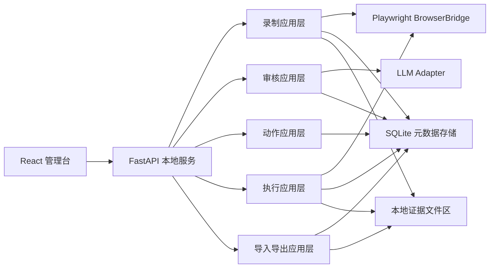

# 技术方案设计

## 相关文档

- [需求文档](../产品文档/需求文档.md)
- [产品原型与信息架构](../产品文档/产品原型与信息架构.md)
- [领域模型与存储模型](./领域模型与存储模型.md)
- [录制器与执行器架构设计](./录制器与执行器架构设计.md)
- [管理台交互流程](../产品文档/管理台交互流程.md)
- [首版实现计划](./首版实现计划.md)
- [开发步骤拆解](./开发步骤拆解.md)

## 1. 文档目的

本文档用于把 `WebToActions` 的首版技术路线正式收口下来，解决“到底用什么栈、怎么分层、如何运行、哪些点先验证”的问题。

当前结论是：

- 不再采用 `Java + Spring Boot + Freemarker` 方案；
- 正式切换到 `Python + FastAPI + React + Playwright Python + SQLite`；
- 先完成本地服务、受控浏览器和管理台闭环，再逐步增强动作抽象与稳定性。

## 2. 技术选型结论

### 2.1 最终选择

首版技术栈建议如下：

- 后端本地服务：`Python 3.11+`
- API 框架：`FastAPI`
- 数据校验与序列化：`Pydantic v2`
- 数据库：`SQLite`
- ORM / 持久化层：`SQLAlchemy 2`
- 数据迁移：`Alembic`
- 浏览器控制：`Playwright Python`
- 前端管理台：`React + TypeScript + Vite`
- 前端路由：`React Router`
- 前端数据获取：`TanStack Query`
- 前端组件库：`Ant Design`
- HTTP 客户端：`httpx`
- 测试：`pytest`、`pytest-asyncio`、前端可补 `Vitest`

### 2.2 为什么选 Python，而不是 Java

这次切换的理由不是“Python 更潮”，而是它更适合当前项目阶段：

- 你自己能维护 `Python`，而不会 `Java`；
- 项目的技术难点在浏览器控制、网络证据采集、动作抽象和本地工具闭环，不在 `Java` 企业应用生态；
- `Python` 更适合快速做技术验证、PoC、浏览器自动化和本地数据处理；
- 首版重点是先跑通闭环，而不是先搭一个很重的企业级工程壳子。

### 2.3 为什么选 FastAPI，而不是 Flask / Django

`FastAPI` 更适合本项目的原因：

- 非常适合作为本地服务 API 层；
- 类型提示、请求响应模型和接口文档支持好；
- 与 `Pydantic` 配合自然；
- 既能在开发期支撑前后端分离，也能在运行期挂载静态资源。

### 2.4 为什么选 React，而不是回到服务端模板

你已经明确选择了前后端分离，因此前端管理台需要有更强的页面组织和交互能力。  
对于这个项目，`React` 的优势在于：

- 适合做时间线、详情侧栏、参数表单、执行日志等复杂界面；
- 内部工具生态成熟，表格、树、步骤流、抽屉和表单组件丰富；
- 便于后续扩展更复杂的审核台与动作编辑器。

### 2.5 为什么选 Playwright Python

它和你的核心需求高度匹配：

- 支持隔离浏览器上下文；
- 可以管理页面导航；
- 可以监听网络请求和响应；
- 适合做受控浏览器录制与浏览器重放执行。

### 2.6 浏览器启动策略

当前浏览器运行策略收口为“双轨制”：

- 默认基线：优先使用 `Playwright` 管理的 `Chromium`
- 可选通道：支持使用本机已安装的 `Google Chrome` 等 branded browser

这样设计的原因是：

- `Playwright` 自带 `Chromium` 版本更稳定、可复现，适合作为技术验证和回归基线；
- 本机 `Chrome` 更贴近日常使用环境，适合验证真实站点兼容性和企业内网页面行为；
- 两者并存，可以避免把“技术链路可行性”与“用户本机环境差异”混在一起排查。

需要特别强调：

- “使用本机 `Chrome`” 不等于“自动复用用户当前日常 `Chrome` 的登录态”；
- 首版仍然以工具维护的隔离上下文为主，而不是直接绑定用户日常主 `Profile`；
- 若必须支持本机 `Chrome`，优先走 `Playwright` 的 `channel="chrome"`，而不是一开始就依赖硬编码 `executable_path`。

## 3. 总体技术架构

## 4. 运行模式设计

### 4.1 开发模式

开发时采用前后端分离：

- 前端：`Vite` 本地开发服务器；
- 后端：`FastAPI` 本地服务；
- 浏览器控制：由后端进程统一拉起；
- 前端通过 `CORS` 调用后端 API。

这种模式的好处是：

- 前端开发体验更好；
- 管理台调试更顺手；
- 后端录制和执行能力不依赖前端构建完成。

### 4.2 运行模式

首版运行时采用本地一体化模式：

- 先构建前端静态资源；
- 后端通过 `FastAPI StaticFiles` 挂载前端产物；
- 用户只需要启动一个本地服务入口；
- 受控浏览器由后端统一管理。

这样既保留了开发期前后端分离的效率，又保证了使用期的部署简单。

## 5. 后端分层设计

后端建议按“接口层 -> 应用层 -> 领域层 -> 基础设施层”组织。

### 5.1 接口层

负责：

- 对前端暴露 HTTP API；
- 处理请求参数、响应模型和错误码；
- 提供录制、审核、动作、执行、会话、导入导出接口；
- 提供实时状态推送接口。

首版建议接口风格：

- 查询类使用 REST；
- 长任务状态用 `SSE` 推送；
- 暂不引入 `WebSocket`，除非后续实时交互复杂度明显提升。

### 5.2 应用层

负责：

- 编排业务流程；
- 协调浏览器桥接层、存储层和 LLM 适配层；
- 处理“开始录制”“结束录制”“生成宏”“执行动作”等完整用例。

应用层模块建议：

- `session`
- `recording`
- `review`
- `action`
- `execution`
- `importexport`

### 5.3 领域层

负责：

- 承载领域对象；
- 定义状态机和版本关系；
- 不直接依赖具体框架。

领域对象以 [领域模型与存储模型](./领域模型与存储模型.md) 为准。

### 5.4 基础设施层

负责：

- `SQLite` 持久化；
- 文件对象区读写；
- `Playwright` 浏览器桥接；
- `LLM` Provider 适配；
- 日志、配置与环境管理。

## 6. 前端架构设计

前端建议采用 `React + TypeScript`，按以下结构组织：

- `pages/`：页面级路由
- `components/`：可复用 UI 组件
- `features/`：录制、审核、动作、执行等业务模块
- `services/`：API 调用封装
- `stores/`：少量全局状态
- `types/`：领域类型定义

### 6.1 页面划分

与现有产品文档保持一致：

- 首页
- 录制中心
- 录制详情
- 元数据审核
- 动作库
- 动作详情
- 执行中心
- 会话管理
- 导入导出

### 6.2 交互原则

- 页内状态以本地组件状态为主；
- 服务器数据统一通过 `TanStack Query` 管理；
- 大表单使用组件库表单能力；
- 首版不追求高度自由的画布式编辑器。

## 7. 浏览器桥接层设计

浏览器桥接层是后端的关键技术模块，应由 `Playwright Python` 封装统一接口。建议暴露：

- 创建和恢复浏览器会话；
- 创建隔离浏览器上下文；
- 打开页面和监听页面导航；
- 监听请求响应；
- 收集会话状态摘要；
- 触发文件上传下载；
- 执行动作步骤。

桥接层应避免把 `Playwright` API 直接散落到业务代码里，否则后续难以维护。

浏览器桥接层还应统一管理“浏览器启动策略”，至少预留以下能力：

- 默认启动 `Playwright` 管理的 `Chromium`
- 可选通过 `channel` 启动本机已安装 `Chrome / Edge`
- 在确有必要时支持自定义浏览器可执行路径
- 明确区分“浏览器程序选择”和“用户资料目录 / 登录态复用”

## 8. 存储方案设计

延续前文的“双层存储”：

- `SQLite`：存结构化索引、状态、版本、关系；
- 文件对象区：存原始请求响应、会话快照、文件传输对象和执行大日志。

### 8.1 为什么不只用 SQLite

因为原始请求响应和证据体积可能很大，全部塞进数据库会导致：

- 查询和分页困难；
- 数据库文件快速膨胀；
- 导出导入复杂度上升。

### 8.2 为什么不只用文件

因为录制、动作、版本、执行记录之间的关系查询很多，只靠文件不适合做管理台检索。

## 9. LLM 接入方案

LLM 在首版中的角色是“生成草案”，而不是替代人工判断。

建议设计一个独立的 `LlmProvider` 适配层，负责：

- 接受证据摘要与上下文；
- 生成 `MetadataDraft`；
- 生成参数化建议；
- 返回统一结构结果。

这样后续可以切换不同模型供应商，而不影响审核主流程。

首版不建议在前端直接调用模型，统一走后端适配层。

## 10. 长任务与状态推送

这个项目存在三类长任务：

- 录制过程；
- 元数据分析；
- 动作执行。

首版建议采用：

- 后端进程内任务协调器；
- 任务状态持久化到 `SQLite`；
- 前端通过 `SSE` 订阅进度和日志。

具体边界建议如下：

- `stopRecording` 完成后端证据收口，并异步投递元数据分析任务；
- 元数据分析任务独立生成 `MetadataDraft`；
- 动作执行任务独立推送步骤日志与最终结果。

首版不引入：

- `Celery`
- `Redis`
- 分布式任务队列

因为当前是本地单机场景，引入这些基础设施收益不高。

## 11. 错误处理与日志

### 11.1 日志原则

- 使用 Python 标准日志体系；
- 每条录制、执行任务带唯一 ID；
- 浏览器桥接层、应用层、API 层日志分开；
- 失败时尽量带步骤上下文。

### 11.2 错误分层

- API 错误：参数非法、对象不存在、状态不允许；
- 应用错误：录制流程中断、执行步骤失败、审核版本冲突；
- 浏览器错误：会话失效、页面超时、请求监听失败；
- 外部错误：LLM 调用失败、文件写入失败。

## 12. 安全与本地运行边界

首版仍然遵循当前产品边界：

- 单机使用；
- 本地明文存储为主；
- 显式提示敏感数据风险；
- 不自动迁移登录态到导出包；
- 不处理验证码绕过或反爬对抗。

## 13. 不采用的方案

### 13.1 不采用 Java 路线

原因：

- 对当前操作者维护门槛过高；
- 首版验证阶段工程重量过大；
- 浏览器控制与快速验证优势不明显。

### 13.2 不采用服务端模板管理台

原因：

- 审核台、时间线、参数面板、执行日志等交互较复杂；
- 前端分离后更利于后续演进。

### 13.3 不采用 Electron / Tauri 作为首版壳子

原因：

- 首版核心难点不在桌面壳；
- 先用本地服务 + 浏览器即可验证核心价值。

## 14. 首批技术 Spike

在正式大规模开发前，建议先验证以下 4 个技术点：

1. `Playwright Python` 能否稳定创建独立上下文并保留本地登录态；
2. 能否稳定采集请求响应、页面导航、`Cookie/Storage` 摘要；
3. `FastAPI + React` 本地模式下的 API 通信和状态推送是否顺畅；
4. `ActionMacro` 最小步骤模型能否在没有细粒度 `DOM` 轨迹的情况下跑通一个简单闭环。

当前这 4 个点已经完成首轮验证，且新增结论如下：

- `Playwright` 自带 `Chromium` 适合作为默认基线；
- 本机 `Chrome` 应作为可选运行通道，而不是替代默认基线；
- 页面状态与 `storage_state()` 必须在浏览器上下文关闭前采集。

## 15. 当前结论

从技术角度看，`Python + FastAPI + React + Playwright Python + SQLite` 是当前最平衡的方案：

- 足够轻；
- 足够可维护；
- 足够适合本地工具；
- 也足够支撑后续扩展。

这条路线比原先的 `Java` 路线更贴合你当前能力边界，也更适合先做出可运行闭环。
