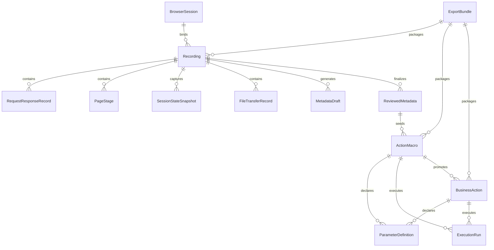

# 领域模型与存储模型

## 相关文档

- [需求文档](../产品文档/需求文档.md)
- [技术方案设计](./技术方案设计.md)
- [开发步骤拆解](./开发步骤拆解.md)
- [产品原型与信息架构](../产品文档/产品原型与信息架构.md)
- [录制器与执行器架构设计](./录制器与执行器架构设计.md)
- [管理台交互流程](../产品文档/管理台交互流程.md)
- [首版实现计划](./首版实现计划.md)

## 1. 文档目的

本文档用于定义 `WebToActions` 首版的核心领域对象，以及这些对象在本地系统中的存储边界。它回答两个问题：

- 系统需要理解哪些业务对象；
- 这些对象分别应该以索引数据、版本数据还是原始证据的形式存储在哪里。

## 2. 建模原则

- 原始证据与解释结果分离：请求响应记录只保留索引摘要与文件引用；分析和人工审核结果以独立对象存储。
- 控制面与数据面分离：便于本地检索的结构化索引进入元数据存储；体积大、变化少的原始内容进入文件对象区。
- 版本优先：审核结果、动作定义和执行结果都允许演进，不能直接覆盖原始证据。
- 原始证据默认不可变：页面阶段、请求响应索引、会话快照、文件传输记录一旦形成就不应被原地改写。
- 单机优先：首版模型首先服务于本地使用，但 ID 设计和导出结构需要为跨机迁移留口。
- 先支撑网络证据主轴：首版领域模型不把细粒度 `DOM` 轨迹作为核心对象。

## 3. 核心领域对象

### 3.1 `BrowserSession`

表示一个由工具管理的浏览器会话。它主要承载：

- 会话 ID；
- 绑定的浏览器 `Profile`；
- 当前登录站点摘要；
- 最近活动时间；
- 状态，例如可用、失效、需要重新登录。

### 3.2 `Recording`

表示一次录制任务，是证据聚合的根对象。它主要承载：

- 录制 ID；
- 录制名称；
- 起始 `URL`；
- 关联 `BrowserSession`；
- 创建时间与结束时间；
- 当前状态，例如录制中、待审核、已生成宏。

### 3.3 `RequestResponseRecord`

表示一次网络请求与响应。它是首版最核心的原始证据对象。主要承载：

- 所属录制 ID；
- 请求 ID；
- 请求方法、地址；
- 可保留重复条目的请求头摘要；
- 请求体文件引用或 `blob key`；
- 响应状态；
- 可保留重复条目的响应头摘要；
- 响应体文件引用或 `blob key`；
- 发起时间、完成时间、耗时；
- 关联页面阶段；
- 失败原因或异常信息。

### 3.4 `PageStage`

表示录制过程中的页面阶段，而不是细粒度交互事件。主要承载：

- 所属录制 ID；
- 阶段 ID；
- 当前页面 `URL`；
- 阶段名称或系统自动摘要；
- 开始时间与结束时间；
- 关联的请求区间；
- 关键等待点或可观测页面状态。

### 3.5 `SessionStateSnapshot`

表示浏览器会话状态快照，用于解释登录态和参数来源。主要承载：

- 所属录制 ID；
- 关联 `BrowserSession`；
- `Cookie` 摘要；
- `Storage` 摘要；
- 采集时间；
- 与页面阶段或请求的关联。

### 3.6 `FileTransferRecord`

表示上传或下载行为。主要承载：

- 所属录制 ID；
- 传输方向：上传或下载；
- 文件名、来源路径或目标路径摘要；
- 关联请求 ID；
- 时间戳；
- 相关备注。

### 3.7 `MetadataDraft`

表示系统基于证据自动生成的元数据草案。主要承载：

- 稳定工件 ID；
- 所属录制 ID；
- 版本号；
- 上一版本号；
- 关键请求候选；
- 参数语义建议；
- 参数来源建议；
- 动作片段建议；
- 模型分析备注。

### 3.8 `ReviewedMetadata`

表示人工审核后的高可信元数据。主要承载：

- 稳定工件 ID；
- 所属录制 ID；
- 审核版本号；
- 上一版本号；
- 关键请求列表；
- 字段说明；
- 参数来源映射；
- 动作阶段划分；
- 风险标记；
- 审核人和审核时间。

### 3.9 `ActionMacro`

表示可回放宏，是首版动作沉淀的主对象。主要承载：

- 稳定动作 ID；
- 来源录制 ID；
- 名称与说明；
- 执行步骤列表；
- 依赖的页面阶段；
- 输入参数定义；
- 会话要求；
- 版本号与上一版本号。

### 3.10 `BusinessAction`

表示在宏基础上进一步抽象的结构化业务动作。首版不是必须对象，但模型上要留位。它主要承载：

- 稳定动作 ID；
- 来源宏 ID；
- 业务名称；
- 业务步骤；
- 输入输出定义；
- 业务约束；
- 版本号与上一版本号。

### 3.11 `ParameterDefinition`

表示动作参数定义。它既可被 `ActionMacro` 使用，也可被 `BusinessAction` 使用。主要承载：

- 参数 ID；
- 所属动作 ID；
- 所属动作类型，需与执行期 `ExecutionRun.action_kind` 共享同一套枚举语义；
- 参数名称；
- 参数类型；
- 是否必填；
- 默认值；
- 注入位置；
- 参数说明。

### 3.12 `ExecutionRun`

表示一次执行记录。主要承载：

- 执行 ID；
- 关联动作 ID；
- 关联动作版本号；
- 运行参数快照；
- 关联浏览器会话；
- 执行开始与结束时间；
- 步骤日志；
- 成功或失败状态；
- 失败定位和诊断信息。

### 3.13 `ExportBundle`

表示一个可导出导入的资料包。主要承载：

- 稳定导出 ID；
- 导出范围；
- 包含的录制、动作、元数据版本；
- 文件清单；
- 自身版本号与上一版本号；
- 包格式版本；
- 导出时间。

## 4. 领域关系图



## 5. 存储模型总览

首版推荐采用两层存储：

- 元数据索引层：保存结构化对象、关系、状态和版本信息，推荐使用本地嵌入式数据库。
- 证据文件层：保存原始请求响应、长文本体、文件传输对象和导出包内容，推荐使用本地文件目录。

这是最适合本地服务形态的组合：查询快、导出方便、也便于控制原始大对象体积。

## 6. 推荐的物理存储划分

### 6.1 元数据索引层

首版建议使用 `SQLite` 作为元数据索引层，原因包括：

- 本地部署成本低；
- 事务能力足够；
- 适合单机使用；
- 适合管理录制、动作、版本和执行记录之间的关系。

建议进入索引层的对象：

- `BrowserSession`
- `Recording`
- `PageStage`
- `MetadataDraft`
- `ReviewedMetadata`
- `ActionMacro`
- `BusinessAction`
- `ParameterDefinition`
- `ExecutionRun`
- `ExportBundle`

### 6.2 证据文件层

以下对象或字段建议进入文件对象区，而不是直接塞进数据库表：

- `RequestResponseRecord` 的原始请求体与响应体；
- `SessionStateSnapshot` 的大体积状态内容；
- `FileTransferRecord` 对应的上传下载文件；
- 执行日志中体积较大的原始上下文；
- 导出包本体。

数据库中只保留这些文件的路径、摘要、哈希和关联 ID。

## 7. 推荐的本地目录结构

```text
.webtoactions/
  app.db
  evidence/
    rec_<recordingId>/
      requests/
      responses/
      session_state/
      file_transfers/
      stage_index.json
  actions/
    macro_<actionId>/
      version_<n>.json
    business_<actionId>/
      version_<n>.json
  runs/
    run_<executionId>/
      run.json
      logs/
  exports/
    bundle_<exportId>/
      version_<n>.zip
```

这个目录结构的目标不是追求极致抽象，而是让人可以直接在磁盘上看懂系统保存了什么。

## 8. 关键表建议

首版可以按以下逻辑设计表，而不必一开始追求复杂范式：

- `browser_session`
- `recording`
- `page_stage`
- `metadata_draft`
- `reviewed_metadata`
- `action_macro`
- `business_action`
- `parameter_definition`
- `execution_run`
- `export_bundle`

对于 `request_response_record`，推荐保留一张轻量索引表，例如：

- 请求 ID；
- 所属录制 ID；
- 请求方法和地址摘要；
- 所属页面阶段；
- 原始文件路径；
- 状态码；
- 时间戳。

这样管理台可以快速筛选和分页，而不需要每次直接读取大对象文件。

## 9. 版本模型

首版版本设计应重点覆盖三类对象：

- `MetadataDraft` / `ReviewedMetadata`
- `ActionMacro` / `BusinessAction`
- `ExportBundle`

版本策略建议如下：

- 原始证据默认不可变；
- 审核结果允许迭代，但每次保存形成新版本；
- 动作定义允许迭代，并记录来源审核版本；
- 导出包本身也采用版本对象语义，允许在同一稳定 bundle ID 下演进文件清单与内部 refs；
- 版本化对象采用“稳定工件 ID + version”口径，同一工件的不同版本保持同一个 `id`；
- 版本链使用 `previous_version` 指向上一版本号，而不是为不同版本生成不同的对象 ID；
- 执行记录永远引用“执行时使用的动作版本”，即 `action_id + action_version`；
- 导出包中的版本引用也采用 `artifact_id + version`，避免导入导出过程中语义漂移。

## 10. 导出导入模型

导出时，建议资料包至少包含：

- 录制摘要；
- 页面阶段信息；
- 请求响应索引；
- 审核后的元数据；
- 动作定义；
- 参数定义；
- 执行记录摘要；
- 清单文件 `manifest.json`。

需要明确：

- 首版导出不默认包含活跃登录态；
- 导入时先做清单预检查，再真正写入本地系统；
- 导入后生成新的本地对象 ID，但保留原始来源 ID 作为追溯字段。

## 11. 与首版范围的关系

由于首版暂不引入细粒度 `DOM` 轨迹，因此当前模型有两个明显特点：

- `PageStage` 是比 `DOMEvent` 更高层的证据对象；
- `ActionMacro` 的生成主要依赖网络证据、页面阶段和人工审核，而不是直接从事件流恢复。

如果后续验证证明当前以网络证据、页面阶段和会话状态为主的证据集不足，可在模型中新增：

- `DomEventRecord`
- `PageElementSnapshot`
- `SelectorBinding`

但这些对象不应提前污染首版主模型。

## 12. 对其他文档的支撑关系

- [产品原型与信息架构](../产品文档/产品原型与信息架构.md) 中每个页面展示的对象，均来自本文定义的领域模型。
- [录制器与执行器架构设计](./录制器与执行器架构设计.md) 将进一步说明这些对象如何被生产和消费。
- [管理台交互流程](../产品文档/管理台交互流程.md) 将说明用户如何编辑和推进这些对象的状态。
- [首版实现计划](./首版实现计划.md) 将把这些对象映射到具体代码结构和实现任务中。
